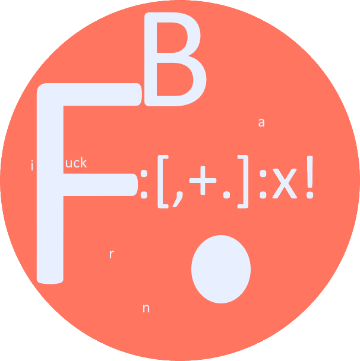

<div id="top"></div>

<!-- PROJECT SHIELDS -->
[![Contributors][contributors-shield]][contributors-url]
[![Forks][forks-shield]][forks-url]
[![Stargazers][stars-shield]][stars-url]
[![Issues][issues-shield]][issues-url]
[![MIT License][license-shield]][license-url]


<!-- PROJECT LOGO -->
<br />
<div align="center">
  <a href="https://github.com/Sellig6792/FuckBF">
    
  </a>

  ### FuckBF
  [Explore documentation][wiki] | [Report Bug][issues] | [Request Feature][issues]
</div>
<br/>


<!-- TABLE OF CONTENTS -->
1. [About the Project](#about-the-project)
2. [Installation](#installation)
    - [Prebuilt Binaries](#1-prebuilt-binaries)
    - [Building from Source](#2-building-from-source)
3. [Usage](#usage)
4. [Contributing](#contributing)
5. [License](#license)
6. [Contact](#contact)
7. [Acknowledgements](#acknowledgements)


<!-- ABOUT THE PROJECT -->
## About The Project

It all started on Graven's Discord server on June 26, 2022.
It was a joke that ended up on this shit...

So FuckBF was born. It is an improvement of the classic BrainFuck, with some new features and new commands.

Already implemented:

- [Functions][wiki-function]
- ["Safe" comments][wiki-comment]
- [Scopes for functions][wiki-scope]
- [Optimization][wiki-optimisation]

<p align="right">(<a href="#top">back to top</a>)</p>

### Built With
![Rust][rust-shield] ![Cargo][cargo-shield]

<p align="right">(<a href="#top">back to top</a>)</p>


## Installation

### 1. Prebuilt binaries

You can download the prebuilt binaries from the [releases page][release].
If your system is not supported, you can [build it yourself](#2-building-from-source).

### 2. Building from source

You need to have [Cargo](https://doc.rust-lang.org/cargo/getting-started/installation.html) installed.

```sh
git clone https://github.com/Sellig6792/FuckBF.git
cd FuckBF
cargo build --release
```

<p align="right">(<a href="#top">back to top</a>)</p>


<!-- USAGE EXAMPLES -->
## Usage
```
fuckbf [OPTIONS] <FILE>
```


### Options
`-O, --optimize` Optimize the code before executing it

`-V, --version` Prints version information

`-h, --help` Prints help information

<p align="right">(<a href="#top">back to top</a>)</p>


<!-- CONTRIBUTING -->
## Contributing

Contributions are what make the open source community such an amazing place to learn, inspire, and create.
Any contributions you make are **greatly appreciated**.

If you have a suggestion that could make this better, please fork the repo and create a pull request.
You can also simply open an issue with the tag "enhancement".
Don't forget to give the project a star! Thanks again!

1. Fork the Project
2. Checkout the develop branch: `git checkout develop`
3. Create your Branch (feature or fix): `git checkout -b [feature/fix]/[name]`
4. Commit your Changes: `git commit -m 'Add some [...]`
5. Push to the Branch: `git push origin [feature/fix]/[name]`
6. Open a Pull Request to the develop branch and explain your changes

<p align="right">(<a href="#top">back to top</a>)</p>


<!-- LICENSE -->
## License

Distributed under the MIT License. See [the licence](LICENSE) for more information.

<p align="right">(<a href="#top">back to top</a>)</p>


<!-- CONTACT -->
## Contact

Sellig6792 - [@Sellig6792](https://twitter.com/Sellig6792) - sellig6792@gmail.com

<p align="right">(<a href="#top">back to top</a>)</p>


<!-- ACKNOWLEDGEMENTS -->
## Acknowledgements

* [Wikipedia - Brainfuck][wikipedia-brainfuck-url]
* [Astremy - Brainfuck Course (French)][astremy-brainfuck-pdf]

<p align="right">(<a href="#top">back to top</a>)</p>


<!-- MARKDOWN LINKS & IMAGES -->
[contributors-shield]: https://img.shields.io/github/contributors/Sellig6792/FuckBF.svg?style=for-the-badge
[contributors-url]: https://github.com/Sellig6792/FuckBF/graphs/contributors

[forks-shield]: https://img.shields.io/github/forks/Sellig6792/FuckBF.svg?style=for-the-badge
[forks-url]: https://github.com/Sellig6792/FuckBF/network/members

[stars-shield]: https://img.shields.io/github/stars/Sellig6792/FuckBF.svg?style=for-the-badge
[stars-url]: https://github.com/Sellig6792/FuckBF/stargazers

[issues-shield]: https://img.shields.io/github/issues/Sellig6792/FuckBF.svg?style=for-the-badge
[issues-url]: https://github.com/Sellig6792/FuckBF/issues

[license-shield]: https://img.shields.io/github/license/Sellig6792/FuckBF.svg?style=for-the-badge
[license-url]: https://github.com/Sellig6792/FuckBF/blob/main/LICENSE
[rust-shield]: https://img.shields.io/badge/-rust-black.svg?style=for-the-badge&logo=rust&colorB=555
[cargo-shield]: https://img.shields.io/badge/-cargo-black.svg?style=for-the-badge&logo=rust&colorB=555
[brainFuck-url]: https://en.wikipedia.org/wiki/Brainfuck
[brainFuck-shield]: https://img.shields.io/badge/-BrainFuck-black.svg?style=for-the-badge&logo=brainfuck&colorB=555

[graven-discord-url]: https://discord.gg/graven
[astremy-brainfuck-pdf]: https://cdn.discordapp.com/attachments/815331771197030441/824402769397940234/brainfuck.pdf
[wikipedia-brainfuck-url]: https://en.wikipedia.org/wiki/Brainfuck

[wiki]: https://github.com/Sellig6792/FuckBF/wiki

[wiki-function]: https://github.com/Sellig6792/FuckBF/wiki#functions
[wiki-optimisation]: https://github.com/Sellig6792/FuckBF/wiki#optimisation
[wiki-scope]: https://github.com/Sellig6792/FuckBF/wiki#scope
[wiki-comment]: https://github.com/Sellig6792/FuckBF/wiki#comments


[issues]: https://github.com/Sellig6792/FuckBF/issues
[release]: https://github.com/Sellig6792/FuckBF/releases
