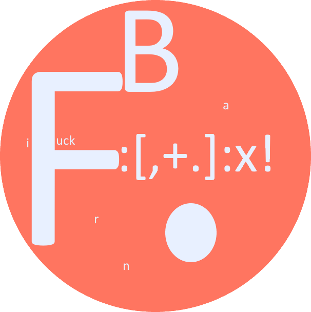

<div id="top"></div>

<!-- PROJECT SHIELDS -->
[![Contributors][contributors-shield]][contributors-url]
[![Forks][forks-shield]][forks-url]
[![Stargazers][stars-shield]][stars-url]
[![Issues][issues-shield]][issues-url]
[![MIT License][license-shield]][license-url]


<!-- PROJECT LOGO -->
<br />
<div align="center">
  <a href="https://github.com/Sellig6792/FuckBrainFuck">
    
  </a>

  <h3 align="center">FuckBrainFuck</h3>
  <p align="center">
    Improved BrainFuck
    <br />
    <a href="https://github.com/Sellig6792/FuckBrainFuck"><strong>Explore the docs »</strong></a>
    <br />
    <br />
    <a href="https://github.com/Sellig6792/FuckBrainFuck">View Demo</a>
    ·
    <a href="https://github.com/Sellig6792/FuckBrainFuck/issues">Report Bug</a>
    ·
    <a href="https://github.com/Sellig6792/FuckBrainFuck/issues">Request Feature</a>
  </p>
</div>


<!-- TABLE OF CONTENTS -->
<details>
  <summary>Table of Contents</summary>
  <ol>
    <li>
      <a href="#about-the-project">About The Project</a>
      <ul>
        <li><a href="#built-with">Built With</a></li>
      </ul>
    </li>
    <li>
      <a href="#getting-started">Getting Started</a>
      <ul>
        <li><a href="#prerequisites">Prerequisites</a></li>
        <li><a href="#installation">Installation</a></li>
      </ul>
    </li>
    <li><a href="#usage">Usage</a></li>
    <li><a href="#roadmap">Roadmap</a></li>
    <li><a href="#contributing">Contributing</a></li>
    <li><a href="#license">License</a></li>
    <li><a href="#contact">Contact</a></li>
    <li><a href="#acknowledgments">Acknowledgments</a></li>
  </ol>
</details>


<!-- ABOUT THE PROJECT -->
## About The Project

It all started on the Discord server of Graven, on 26<sup>th</sup> June 2022.
It was a joke that ended up on this shit...

So FuckBrainFuck was born. It is an improvement of the classic BrainFuck.

We have already implemented:

- Functions
- "Safe" comments

<p align="right">(<a href="#top">back to top</a>)</p>


### Built With

* [![Python][python-shield]][python-url]

<p align="right">(<a href="#top">back to top</a>)</p>


<!-- GETTING STARTED -->
## Getting Started

### Prerequisites

You may need to install Python 3.6 or higher.

### Installation


1. Clone the repo
   ```sh
   git clone https://github.com/Sellig6792/FuckBrainFuck.git
   ```


<p align="right">(<a href="#top">back to top</a>)</p>


<!-- USAGE EXAMPLES -->
## Usage

Soon...

[//]: # (<p align="right">&#40;<a href="#top">back to top</a>&#41;</p>)


<!-- CONTRIBUTING -->
## Contributing

Contributions are what make the open source community such an amazing place to learn, inspire, and create.
Any contributions you make are **greatly appreciated**.

If you have a suggestion that would make this better, please fork the repo and create a pull request.
You can also simply open an issue with the tag "enhancement".
Don't forget to give the project a star! Thanks again!

1. Fork the Project
2. Create your Feature Branch (`git flow feature start [feature name]`)
3. Commit your Changes (`git commit -m 'Add some AmazingFeature'`)
4. Push to the Branch (`git flow feature publish [feature name]`)
5. Open a Pull Request on the develop branch

<p align="right">(<a href="#top">back to top</a>)</p>


<!-- LICENSE -->
## License

Distributed under the MIT License. See `LICENSE.txt` for more information.

<p align="right">(<a href="#top">back to top</a>)</p>


<!-- CONTACT -->
## Contact

Your Name - [@Sellig6792](https://twitter.com/Sellig6792) - sellig6792@gmail.com

Project Link: [https://github.com/Sellig6792/FuckBrainFuck](https://github.com/Sellig6792/FuckBrainFuck)

<p align="right">(<a href="#top">back to top</a>)</p>


<!-- ACKNOWLEDGMENTS -->
## Acknowledgments

* [Wikipedia - Brainfuck][wikipedia-brainfuck-url]
* [Astremy - Brainfuck Course (French)][astremy-brainfuck-pdf]
<p align="right">(<a href="#top">back to top</a>)</p>


<!-- MARKDOWN LINKS & IMAGES -->
<!-- https://www.markdownguide.org/basic-syntax/#reference-style-links -->
[contributors-shield]: https://img.shields.io/github/contributors/Sellig6792/FuckBrainFuck.svg?style=for-the-badge
[contributors-url]: https://github.com/Sellig6792/FuckBrainFuck/graphs/contributors
[forks-shield]: https://img.shields.io/github/forks/Sellig6792/FuckBrainFuck.svg?style=for-the-badge
[forks-url]: https://github.com/Sellig6792/FuckBrainFuck/network/members
[stars-shield]: https://img.shields.io/github/stars/Sellig6792/FuckBrainFuck.svg?style=for-the-badge
[stars-url]: https://github.com/Sellig6792/FuckBrainFuck/stargazers
[issues-shield]: https://img.shields.io/github/issues/Sellig6792/FuckBrainFuck.svg?style=for-the-badge
[issues-url]: https://github.com/Sellig6792/FuckBrainFuck/issues
[license-shield]: https://img.shields.io/github/license/Sellig6792/FuckBrainFuck.svg?style=for-the-badge
[license-url]: https://github.com/Sellig6792/FuckBrainFuck/blob/master/LICENSE.txt
[Python-url]: https://www.python.org/
[Python-shield]: https://img.shields.io/badge/-Python-black.svg?style=for-the-badge&logo=python&colorB=555
[BrainFuck-url]: https://en.wikipedia.org/wiki/Brainfuck
[BrainFuck-shield]: https://img.shields.io/badge/-BrainFuck-black.svg?style=for-the-badge&logo=brainfuck&colorB=555

[graven-discord-url]: https://discord.gg/graven
[astremy-brainfuck-pdf]: https://cdn.discordapp.com/attachments/815331771197030441/824402769397940234/brainfuck.pdf
[wikipedia-brainfuck-url]: https://en.wikipedia.org/wiki/Brainfuck
